```mermaid
stateDiagram-v2
    [*] --> STARTED: Initialize Saga
    
    STARTED --> INVENTORY_VALIDATION: Execute Step 1
    INVENTORY_VALIDATION --> PAYMENT_PROCESSING: Inventory Reserved ✓
    INVENTORY_VALIDATION --> COMPENSATING: Inventory Failed ✗
    
    PAYMENT_PROCESSING --> SHIPPING_ARRANGEMENT: Payment Processed ✓
    PAYMENT_PROCESSING --> COMPENSATING: Payment Failed ✗
    
    SHIPPING_ARRANGEMENT --> ORDER_CONFIRMATION: Shipping Arranged ✓
    SHIPPING_ARRANGEMENT --> COMPENSATING: Shipping Failed ✗
    
    ORDER_CONFIRMATION --> COMPLETED: All Steps Done
    
    COMPENSATING --> FAILED: All Compensated
    
    COMPLETED --> [*]
    FAILED --> [*]
    
    note right of INVENTORY_VALIDATION
        Transaction commits here
        State: inventoryReserved=true
        Transaction ID stored
    end note
    
    note right of PAYMENT_PROCESSING
        Transaction commits here
        State: paymentProcessed=true
        Transaction ID stored
    end note
    
    note right of SHIPPING_ARRANGEMENT
        Transaction commits here
        State: shippingArranged=true
        Tracking number stored
    end note
    
    note right of COMPENSATING
        Uses committed transaction IDs
        to reverse operations:
        - Refund payment
        - Release inventory
    end note
```

# Order Service - E-commerce Microservices Platform

A production-ready order management microservice implementing the SAGA orchestration pattern with independent transaction boundaries, comprehensive resilience patterns, and full observability.

## Table of Contents

- [Overview](#overview)
- [Architecture](#architecture)
- [Key Features](#key-features)
- [Technology Stack](#technology-stack)
- [Prerequisites](#prerequisites)
- [Quick Start](#quick-start)
- [Configuration](#configuration)
- [API Documentation](#api-documentation)
- [SAGA Pattern Implementation](#saga-pattern-implementation)
- [Resilience Patterns](#resilience-patterns)
- [Testing](#testing)
- [Monitoring & Observability](#monitoring--observability)
- [Deployment](#deployment)
- [Troubleshooting](#troubleshooting)

## Overview

The Order Service is the orchestrator of the e-commerce platform, coordinating distributed transactions across multiple microservices (Inventory, Payment, and Shipping) using the SAGA orchestration pattern. It ensures data consistency in a microservices architecture without distributed transactions (2PC).

### Core Responsibilities

- **Order Management**: Create, retrieve, update, and cancel customer orders
- **SAGA Orchestration**: Coordinate multi-step distributed transactions with compensation
- **Transaction Isolation**: Each saga step executes in independent transactions with async processing
- **Resilience**: Circuit breakers, retries, bulkheads, and graceful degradation
- **State Management**: Track saga state and support retryable failures
- **Compensation**: Automatic rollback of committed steps when failures occur

## Architecture

### Component Architecture


### Key Architectural Principles

1. **Independent Transaction Boundaries**: Each saga step commits independently, preventing rollback of earlier committed steps
2. **Async Execution**: Steps execute asynchronously to avoid blocking and holding transactions
3. **Entity Management**: Each transaction reloads entities to avoid detached entity issues
4. **Compensation-Based Recovery**: Failed steps trigger compensation of previously committed operations
5. **Idempotency**: All operations are idempotent to support safe retries

### Transaction Boundary Visualization


## Key Features

### SAGA Pattern with Transaction Isolation

- **Independent Transactions**: Each saga step (inventory, payment, shipping) executes in its own transaction with `REQUIRES_NEW` propagation
- **Async Processing**: Steps run asynchronously using Spring's `@Async` to prevent transaction hold times
- **Proper Entity Management**: Entities are reloaded in each transaction to avoid Hibernate detached entity issues
- **State Persistence**: Saga state commits independently before each step executes

### Comprehensive Resilience

- **Circuit Breakers**: Protect against cascading failures with configurable thresholds
- **Retry Mechanisms**: Exponential backoff retries with configurable attempts
- **Bulkheads**: Thread pool isolation to prevent resource exhaustion
- **Fallback Methods**: Graceful degradation when services are unavailable
- **Timeout Protection**: Configurable connection and read timeouts

### Compensation Logic

- **Automatic Rollback**: Failed saga steps trigger compensation of previously committed operations
- **Retryable Failures**: Distinguish between temporary and permanent failures
- **Compensation State Tracking**: Track which steps need compensation and their completion status
- **Manual Recovery**: Support for manual intervention when automatic compensation fails

### Observability

- **Health Checks**: Comprehensive health indicators via Spring Boot Actuator
- **Metrics**: Prometheus-compatible metrics for monitoring
- **Logging**: Structured logging with correlation IDs
- **Circuit Breaker Events**: Real-time visibility into circuit state transitions

## Technology Stack

### Core Framework
- **Spring Boot 3.3.5**: Latest Spring Boot with Java 17
- **Spring Data JPA**: ORM with Hibernate 6.5.3
- **Spring Web**: RESTful API implementation
- **Spring Async**: Asynchronous task execution

### Database
- **PostgreSQL**: Primary production database
- **H2**: In-memory database for testing
- **Liquibase/Flyway**: Database migration support (optional)

### Microservices Communication
- **OpenFeign**: Declarative HTTP client for service-to-service communication
- **Spring Cloud**: Microservices infrastructure

### Resilience
- **Resilience4j 2.1.0**: Circuit breakers, retries, bulkheads, rate limiters
  - Circuit Breaker: Prevent cascading failures
  - Retry: Automatic retry with exponential backoff
  - Bulkhead: Resource isolation and thread pool management
  - Rate Limiter: Request throttling

### Monitoring & Observability
- **Spring Boot Actuator**: Production-ready features
- **Micrometer**: Application metrics facade
- **Prometheus**: Metrics collection and alerting
- **Grafana**: Metrics visualization (optional)

### Testing
- **JUnit 5**: Unit and integration testing
- **Mockito**: Mocking framework
- **WireMock**: HTTP service mocking for integration tests
- **Testcontainers**: Docker containers for integration tests
- **Awaitility**: Async testing support

### Development Tools
- **Lombok**: Reduce boilerplate code
- **MapStruct**: Type-safe bean mapping (optional)
- **Spring Boot DevTools**: Development productivity

## Prerequisites

### Required
- **Java 17** or higher
- **Maven 3.8+** or use included Maven wrapper
- **PostgreSQL 14+** (or Docker)

### Optional
- **Docker & Docker Compose**: For containerized deployment
- **Postman/curl**: API testing
- **IntelliJ IDEA/VS Code**: IDE with Spring Boot support

## Quick Start

### 1. Clone the Repository

```bash
git clone <repository-url>
cd order_service
```

### 2. Configure Database

**Option A: Local PostgreSQL**

```bash
# Create database
createdb order_db

# Update application.yml with your credentials
spring:
  datasource:
    url: jdbc:postgresql://localhost:5432/order_db
    username: your_username
    password: your_password
```

**Option B: Docker PostgreSQL**

```bash
docker run -d \
  --name postgres-order \
  -e POSTGRES_DB=order_db \
  -e POSTGRES_USER=postgres \
  -e POSTGRES_PASSWORD=postgres \
  -p 5432:5432 \
  postgres:14-alpine
```

### 3. Start External Services (Mock)

For development/testing without actual microservices:

```bash
# Start WireMock services
docker-compose --profile mock up -d

# Services will be available at:
# - Inventory: http://localhost:8081
# - Payment: http://localhost:8082
# - Shipping: http://localhost:8083
```

### 4. Build and Run

```bash
# Build the application
./mvnw clean package

# Run the application
./mvnw spring-boot:run

# Or run the JAR
java -jar target/order-0.0.1-SNAPSHOT.jar
```

The service will start on `http://localhost:8080`

### 5. Verify Installation

```bash
# Check health
curl http://localhost:8080/actuator/health

# Expected response:
# {"status":"UP"}
```

## Configuration

### Application Properties

The service uses `application.yml` with environment variable overrides. Key configurations:

#### Database Configuration

```yaml
spring:
  datasource:
    url: ${SPRING_DATASOURCE_URL:jdbc:postgresql://localhost:5432/order_db}
    username: ${SPRING_DATASOURCE_USERNAME:postgres}
    password: ${SPRING_DATASOURCE_PASSWORD:postgres}
```

#### External Services

```yaml
services:
  inventory:
    url: ${INVENTORY_SERVICE_URL:http://localhost:8081}
  payment:
    url: ${PAYMENT_SERVICE_URL:http://localhost:8082}
  shipping:
    url: ${SHIPPING_SERVICE_URL:http://localhost:8083}
```

#### Circuit Breaker Settings

```yaml
resilience4j:
  circuitbreaker:
    instances:
      inventoryService:
        slidingWindowSize: 10
        minimumNumberOfCalls: 5
        failureRateThreshold: 50
        waitDurationInOpenState: 30s
```

#### Retry Configuration

```yaml
resilience4j:
  retry:
    instances:
      inventoryService:
        maxAttempts: 3
        waitDuration: 1s
        enableExponentialBackoff: true
        exponentialBackoffMultiplier: 2
```

### Environment Variables

Create a `.env` file for local development:

```bash
# Database
SPRING_DATASOURCE_URL=jdbc:postgresql://localhost:5432/order_db
SPRING_DATASOURCE_USERNAME=postgres
SPRING_DATASOURCE_PASSWORD=postgres

# External Services
INVENTORY_SERVICE_URL=http://localhost:8081
PAYMENT_SERVICE_URL=http://localhost:8082
SHIPPING_SERVICE_URL=http://localhost:8083

# Server
SERVER_PORT=8080

# JPA
SPRING_JPA_SHOW_SQL=true
SPRING_JPA_HIBERNATE_DDL_AUTO=update

# Actuator
MANAGEMENT_ENDPOINTS_WEB_EXPOSURE_INCLUDE=health,info,metrics,prometheus
```

## API Documentation

### Order Endpoints

#### Create Order

```http
POST /api/orders
Content-Type: application/json

{
  "customerId": 123,
  "shippingAddress": "123 Main St, City, Country",
  "items": [
    {
      "productId": 1,
      "quantity": 2,
      "unitPrice": 29.99
    },
    {
      "productId": 2,
      "quantity": 1,
      "unitPrice": 49.99
    }
  ]
}
```

**Response (201 Created):**

```json
{
  "id": 1,
  "orderNumber": "ORD-20251224123456-789",
  "customerId": 123,
  "status": "PROCESSING",
  "totalAmount": 109.97,
  "shippingAddress": "123 Main St, City, Country",
  "items": [
    {
      "id": 1,
      "productId": 1,
      "quantity": 2,
      "unitPrice": 29.99,
      "subtotal": 59.98
    },
    {
      "id": 2,
      "productId": 2,
      "quantity": 1,
      "unitPrice": 49.99,
      "subtotal": 49.99
    }
  ],
  "createdAt": "2025-12-24T12:34:56",
  "updatedAt": "2025-12-24T12:34:56"
}
```

#### Get Order by ID

```http
GET /api/orders/{id}
```

#### Get Order by Number

```http
GET /api/orders/number/{orderNumber}
```

#### Get Orders by Customer

```http
GET /api/orders/customer/{customerId}
```

#### Cancel Order

```http
POST /api/orders/{id}/cancel
```

### Order Status Flow


### Health & Metrics Endpoints

```http
# Health check
GET /actuator/health

# Detailed health
GET /actuator/health/circuitBreakers

# Metrics
GET /actuator/metrics

# Prometheus metrics
GET /actuator/prometheus
```

## SAGA Pattern Implementation

### Overview

This service implements the **Orchestration-based SAGA pattern** with **independent transaction boundaries** for each saga step. This is critical for proper compensation when failures occur.

### SAGA Success Flow

```mermaid
graph TD
    Start([Client Creates Order]) --> CreateOrder[1. Create Order<br/>Transaction COMMITS]
    CreateOrder --> InitSaga[2. Initialize Saga State<br/>Transaction COMMITS]
    InitSaga --> Inventory[3. Reserve Inventory<br/>Transaction COMMITS]
    Inventory -->|Success| Payment[4. Process Payment<br/>Transaction COMMITS]
    Payment -->|Success| Shipping[5. Arrange Shipping<br/>Transaction COMMITS]
    Shipping -->|Success| Complete[6. Complete Order<br/>Status = COMPLETED]
    Complete --> End([Order Fulfilled ✓])
    
    style Start fill:#4CAF50
    style CreateOrder fill:#4CAF50
    style InitSaga fill:#4CAF50
    style Inventory fill:#4CAF50
    style Payment fill:#4CAF50
    style Shipping fill:#4CAF50
    style Complete fill:#4CAF50
    style End fill:#4CAF50
```



### SAGA Failure Flow with Compensation

```mermaid
graph TD
    Start([Client Creates Order]) --> CreateOrder[1. Create Order<br/>✓ COMMITTED]
    CreateOrder --> InitSaga[2. Initialize Saga State<br/>✓ COMMITTED]
    InitSaga --> Inventory[3. Reserve Inventory<br/>✓ COMMITTED]
    Inventory --> Payment[4. Process Payment<br/>✓ COMMITTED]
    Payment --> Shipping[5. Arrange Shipping<br/>✗ FAILED]
    
    Shipping --> MarkRetryable{Is Retryable?}
    
    MarkRetryable -->|No| StartComp[Start Compensation]
    MarkRetryable -->|Yes| CheckRetries{Retries<br/>Exhausted?}
    CheckRetries -->|No| ScheduleRetry[Schedule Retry]
    CheckRetries -->|Yes| StartComp
    
    StartComp --> CompPayment[Compensate: Refund Payment<br/>Using Committed Transaction ID]
    CompPayment --> CompInventory[Compensate: Release Inventory<br/>Using Committed Transaction ID]
    CompInventory --> MarkFailed[Mark Order as FAILED<br/>Transaction COMMITS]
    MarkFailed --> End([Order Failed with Compensation ✓])
    
    ScheduleRetry --> RetryShipping[Retry Shipping from Step 5]
    RetryShipping -->|Success| Complete[Complete Order]
    RetryShipping -->|Failed Again| StartComp
    
    style Start fill:#4CAF50
    style CreateOrder fill:#4CAF50
    style InitSaga fill:#4CAF50
    style Inventory fill:#4CAF50
    style Payment fill:#4CAF50
    style Shipping fill:#f44336
    style StartComp fill:#FF9800
    style CompPayment fill:#FF9800
    style CompInventory fill:#FF9800
    style MarkFailed fill:#f44336
    style End fill:#FF9800
```



### Detailed Success Sequence

```mermaid
sequenceDiagram
    autonumber
    participant C as Client
    participant OC as OrderController
    participant OS as OrderService
    participant SO as SagaOrchestrator
    participant SE as SagaStepExecutor
    participant SS as SagaStateService
    participant DB as Database
    participant IS as Inventory Service
    participant PS as Payment Service
    participant SHS as Shipping Service
    
    C->>OC: POST /api/orders
    activate OC
    OC->>OS: createOrder(request)
    activate OS
    
    Note over OS,DB: TX1: Create Order (REQUIRES_NEW)
    OS->>DB: INSERT Order & Items
    OS->>DB: COMMIT ✓
    
    OS->>SO: startSaga(orderId)
    activate SO
    
    Note over SO,DB: TX2: Init Saga (REQUIRES_NEW)
    SO->>DB: INSERT SagaState
    SO->>DB: COMMIT ✓
    
    SO->>SE: executeInventoryStep(orderId)
    deactivate SO
    OS-->>OC: OrderResponse
    deactivate OS
    OC-->>C: 201 Created
    deactivate OC
    
    Note over SE: Async execution starts
    activate SE
    
    Note over SE,DB: TX3: Inventory Step (REQUIRES_NEW)
    SE->>DB: SELECT Order (reload)
    SE->>IS: POST /reserve
    IS-->>SE: InventoryResponse(txId)
    SE->>SS: updateInventoryState(order, response)
    activate SS
    SS->>DB: UPDATE SagaState
    SS->>DB: COMMIT ✓
    deactivate SS
    
    Note over SE,DB: TX4: Payment Step (REQUIRES_NEW)
    SE->>SE: executePaymentStep(orderId)
    SE->>DB: SELECT Order (reload)
    SE->>PS: POST /process
    PS-->>SE: PaymentResponse(txId)
    SE->>SS: updatePaymentState(order, response)
    activate SS
    SS->>DB: UPDATE SagaState
    SS->>DB: COMMIT ✓
    deactivate SS
    
    Note over SE,DB: TX5: Shipping Step (REQUIRES_NEW)
    SE->>SE: executeShippingStep(orderId)
    SE->>DB: SELECT Order (reload)
    SE->>SHS: POST /arrange
    SHS-->>SE: ShippingResponse(trackingId)
    SE->>SS: updateShippingState(order, response)
    activate SS
    SS->>DB: UPDATE SagaState
    SS->>DB: UPDATE Order (COMPLETED)
    SS->>DB: COMMIT ✓
    deactivate SS
    deactivate SE
    
    Note over DB: All 5 transactions committed independently!
```



### Detailed Failure & Compensation Sequence

```mermaid
sequenceDiagram
    autonumber
    participant C as Client
    participant OS as OrderService
    participant SE as SagaStepExecutor
    participant SS as SagaStateService
    participant CS as CompensationService
    participant DB as Database
    participant IS as Inventory Service
    participant PS as Payment Service
    participant SHS as Shipping Service
    
    C->>OS: POST /api/orders
    
    Note over OS,DB: TX1: Create Order ✓ COMMITTED
    OS->>DB: INSERT Order
    OS->>DB: COMMIT
    
    Note over OS,DB: TX2: Init Saga ✓ COMMITTED
    OS->>DB: INSERT SagaState
    OS->>DB: COMMIT
    
    OS-->>C: 201 Created
    
    Note over SE: Async execution
    
    Note over SE,IS: TX3: Inventory ✓ COMMITTED
    SE->>DB: SELECT Order
    SE->>IS: POST /reserve
    IS-->>SE: Success (inv-tx-123)
    SE->>DB: UPDATE SagaState
    SE->>DB: COMMIT ✓
    
    Note over SE,PS: TX4: Payment ✓ COMMITTED
    SE->>DB: SELECT Order
    SE->>PS: POST /process
    PS-->>SE: Success (pay-tx-456)
    SE->>DB: UPDATE SagaState
    SE->>DB: COMMIT ✓
    
    Note over SE,SHS: TX5: Shipping ✗ FAILED
    SE->>DB: SELECT Order
    SE->>SHS: POST /arrange
    SHS-->>SE: Error (Connection Refused)
    
    SE->>SE: handleStepFailure()
    
    Note over SE,DB: TX6: Mark Retryable
    SE->>SS: updateRetryableState(order, true)
    SS->>DB: UPDATE SagaState (retryable=true)
    SS->>DB: COMMIT ✓
    
    Note over SE,DB: TX7: Mark Failed
    SE->>SS: failOrderAndSaga(order)
    SS->>DB: UPDATE Order (status=FAILED)
    SS->>DB: UPDATE SagaState (status=FAILED)
    SS->>DB: COMMIT ✓
    
    Note over SE,CS: TX8: Compensation (REQUIRES_NEW)
    SE->>CS: compensateAfterFailure(order)
    activate CS
    
    CS->>DB: SELECT SagaState
    
    Note over CS: Check payment committed?
    CS->>CS: isPaymentProcessed() → true
    CS->>PS: POST /refund/pay-tx-456
    PS-->>CS: Success (refunded)
    CS->>DB: UPDATE SagaState (payment_compensated)
    
    Note over CS: Check inventory committed?
    CS->>CS: isInventoryReserved() → true
    CS->>IS: POST /release/inv-tx-123
    IS-->>CS: Success (released)
    CS->>DB: UPDATE SagaState (inventory_compensated)
    
    CS->>DB: COMMIT ✓
    deactivate CS
    
    Note over DB: Compensation complete!<br/>Inventory and Payment reversed<br/>using their committed transaction IDs
```



### SAGA Execution Flow

1. **Order Creation**
   - Creates order and items in database
   - Transaction commits immediately
   - Returns order response to client

2. **SAGA Initialization**
   - Creates initial saga state with `REQUIRES_NEW`
   - State commits before any steps execute
   - Starts async saga workflow

3. **Inventory Step (Async)**
   - Runs in separate thread with new transaction
   - Loads order entity from database
   - Calls inventory service
   - Updates saga state
   - Commits independently

4. **Payment Step (Async)**
   - New transaction (REQUIRES_NEW)
   - Inventory reservation already committed
   - Processes payment
   - Commits independently

5. **Shipping Step (Async)**
   - New transaction (REQUIRES_NEW)
   - Both inventory and payment committed
   - Arranges shipping
   - Commits independently

### Compensation Logic

When a step fails, **previously committed steps remain in database** and can be compensated:

```java
// Shipping fails - inventory and payment already committed
executeShippingStep() → FAILS

// Compensation accesses committed state
compensate() {
    // 1. Refund payment (using committed payment transaction ID)
    refundPayment(sagaState.getPaymentTransactionId());
    
    // 2. Release inventory (using committed inventory transaction ID)
    releaseInventory(sagaState.getInventoryTransactionId());
    
    // 3. Mark order as FAILED (persists in database)
}
```

### Key Implementation Classes

#### 1. SagaStepExecutor

Executes saga steps asynchronously with independent transactions:

```java
@Service
@Async
@Transactional(propagation = Propagation.REQUIRES_NEW)
public void executeInventoryStep(Long orderId) {
    Order order = getOrder(orderId); // Reload in new transaction
    SagaState sagaState = getSagaState(order);
    
    // Execute step...
    
    sagaStateService.updateInventoryStateAndProceed(order, response);
}
```

#### 2. SagaStateService

Manages saga state with REQUIRES_NEW propagation:

```java
@Transactional(propagation = Propagation.REQUIRES_NEW)
public void updateInventoryStateAndProceed(Order order, InventoryResponse response) {
    // Reload order in new transaction to avoid detached entity
    Order managedOrder = orderRepository.findById(order.getId())
        .orElseThrow();
    
    SagaState sagaState = getSagaState(managedOrder);
    
    // Update state
    sagaState.setInventoryReserved(true);
    sagaState.setInventoryTransactionId(response.getTransactionId());
    sagaState.setCurrentStep(SagaStep.PAYMENT_PROCESSING);
    
    // Commit independently
    sagaStateRepository.save(sagaState);
    orderRepository.save(managedOrder);
}
```

#### 3. CompensationService

Handles rollback of committed operations:

```java
@Transactional(propagation = Propagation.REQUIRES_NEW)
public void compensateAfterFailure(Order order) {
    SagaState sagaState = getSagaState(order);
    
    // Compensate in reverse order
    if (sagaState.isPaymentProcessed()) {
        refundPayment(sagaState.getPaymentTransactionId());
    }
    if (sagaState.isInventoryReserved()) {
        releaseInventory(sagaState.getInventoryTransactionId());
    }
}
```
   

### Retry Flow Diagram


### SAGA State Machine



### Retry Strategy

The service implements sophisticated retry logic for transient failures:

- **Saga-Level Retries**: Entire saga can be retried from last failed step
- **Service-Level Retries**: Individual service calls retry with exponential backoff
- **Circuit Breaker**: Prevents retry storms when services are down
- **Retryable Flag**: Distinguishes permanent vs temporary failures

```java
// Retryable failure (network timeout)
if (sagaState.isRetryable() && sagaState.getRetryCount() < maxRetries) {
    scheduleRetry(order);
} else {
    // Permanent failure - trigger compensation
    compensate(order);
}
```

## 🛡️ Resilience Patterns

### Resilience Architecture


### Circuit Breaker State Transitions

```mermaid
stateDiagram-v2
    [*] --> CLOSED: Application Starts
    
    CLOSED --> OPEN: Failure Rate > 50%<br/>AND<br/>Min 5 calls made
    CLOSED --> CLOSED: Normal Operation<br/>(Failure Rate < 50%)
    
    OPEN --> HALF_OPEN: Wait Duration Elapsed<br/>(30 seconds)
    
    HALF_OPEN --> CLOSED: 3 Consecutive<br/>Successful Calls
    HALF_OPEN --> OPEN: Any Call Fails
    
    OPEN --> [*]: Manual Reset
    CLOSED --> [*]: Service Shutdown
    
    note right of CLOSED
        ✓ All requests pass through
        ✓ Monitoring failure rate
        ✓ Buffering last 10 calls
        ✓ Calculating metrics
    end note
    
    note right of OPEN
        ✗ All requests blocked
        ✗ Fallback method invoked
        ✗ No calls to external service
        ⏱ Waiting 30s before retry
    end note
    
    note right of HALF_OPEN
        🔄 Testing with 3 calls
        🔄 Checking service recovery
        🔄 Quick transition to OPEN/CLOSED
        🔄 Partial traffic allowed
    end note
```



### SAGA State Machine


### Retry Strategy

The service implements sophisticated retry logic for transient failures:

- **Saga-Level Retries**: Entire saga can be retried from last failed step
- **Service-Level Retries**: Individual service calls retry with exponential backoff
- **Circuit Breaker**: Prevents retry storms when services are down
- **Retryable Flag**: Distinguishes permanent vs temporary failures

```java
// Retryable failure (network timeout)
if (sagaState.isRetryable() && sagaState.getRetryCount() < maxRetries) {
    scheduleRetry(order);
} else {
    // Permanent failure - trigger compensation
    compensate(order);
}
```
   

### Complete Request Flow with Resilience


## Resilience Patterns

### Circuit Breaker

Prevents cascading failures by stopping requests to failing services:

```yaml
resilience4j:
  circuitbreaker:
    instances:
      inventoryService:
        failureRateThreshold: 50          # Open at 50% failure rate
        slidingWindowSize: 10              # Last 10 calls
        minimumNumberOfCalls: 5            # Minimum before opening
        waitDurationInOpenState: 30s       # Wait before attempting half-open
        permittedNumberOfCallsInHalfOpenState: 3  # Test calls in half-open
```

**States:**
- **CLOSED**: Normal operation, all requests pass through
- **OPEN**: Circuit is open, all requests fail immediately (fallback)
- **HALF_OPEN**: Testing if service recovered, limited requests

### Retry

Automatic retry with exponential backoff:

```yaml
resilience4j:
  retry:
    instances:
      inventoryService:
        maxAttempts: 3                     # Total 3 attempts
        waitDuration: 1s                   # Initial wait 1 second
        enableExponentialBackoff: true     # Double each time
        exponentialBackoffMultiplier: 2    # 1s → 2s → 4s
```

### Bulkhead

Isolate thread pools to prevent resource exhaustion:

```yaml
resilience4j:
  bulkhead:
    instances:
      inventoryService:
        maxConcurrentCalls: 10             # Max 10 concurrent calls
        maxWaitDuration: 500ms             # Wait max 500ms for slot
```

### Timeout

Prevent indefinite waits:

```yaml
feign:
  client:
    config:
      default:
        connectTimeout: 5000               # 5 second connect timeout
        readTimeout: 5000                  # 5 second read timeout
```

### Fallback Methods

Graceful degradation when services fail:

```java
@CircuitBreaker(name = "inventoryService", fallbackMethod = "fallbackReserveInventory")
public InventoryResponse reserveInventory(InventoryRequest request) {
    return inventoryClient.reserveInventory(request);
}

// Fallback returns safe response
public InventoryResponse fallbackReserveInventory(InventoryRequest request, Exception ex) {
    return InventoryResponse.builder()
        .success(false)
        .message("Inventory service temporarily unavailable - please retry later")
        .retryable(true)
        .build();
}
```

## Testing

### Run All Tests

```bash
# Unit and integration tests
./mvnw test

# With coverage
./mvnw test jacoco:report
```

### Unit Tests

Test individual components in isolation:

```bash
./mvnw test -Dtest=OrderServiceImplTest
./mvnw test -Dtest=SagaOrchestratorImplTest
```

### Integration Tests

Test complete SAGA workflows with transaction isolation:

```bash
./mvnw test -Dtest=SagaTransactionIsolationIntegrationTest
```

**Key Test Scenarios:**
- Verify inventory step commits before payment
- Verify committed state survives subsequent failures
- Verify compensation accesses committed state
- Verify retry resumes from correct step

### WireMock Integration

WireMock is configured to simulate external services:

```bash
# Start WireMock standalone
docker-compose --profile mock up -d

# Mock responses configured in:
# - order_service/wiremock/inventory/mappings/
# - order_service/wiremock/payment/mappings/
# - order_service/wiremock/shipping/mappings/
```

### Testing with Postman

Import the HTTP requests from `http/endpoints.http`:

```http
### Create Order - Success Scenario
POST http://localhost:8080/api/orders
Content-Type: application/json

{
  "customerId": 123,
  "shippingAddress": "123 Main St",
  "items": [...]
}
```

## Monitoring & Observability

### Health Checks

```bash
# Overall health
curl http://localhost:8080/actuator/health

# Circuit breaker health
curl http://localhost:8080/actuator/health/circuitBreakers

# Database health
curl http://localhost:8080/actuator/health/db
```

### Metrics

```bash
# All metrics
curl http://localhost:8080/actuator/metrics

# Specific metric
curl http://localhost:8080/actuator/metrics/resilience4j.circuitbreaker.calls

# Prometheus format
curl http://localhost:8080/actuator/prometheus
```

### Key Metrics to Monitor

**Circuit Breaker Metrics:**
- `resilience4j.circuitbreaker.state` - Current state (0=closed, 1=open, 2=half-open)
- `resilience4j.circuitbreaker.calls` - Total calls (success/failure)
- `resilience4j.circuitbreaker.failure.rate` - Failure rate percentage

**SAGA Metrics:**
- Order success rate
- Average saga completion time
- Compensation execution count
- Retry count by step

**JVM Metrics:**
- Memory usage
- Thread count
- GC metrics

### Logging

Structured logging with meaningful context:

```log
2025-12-24 12:34:56 INFO  [order-service] [http-nio-8080-exec-1] OrderController - Received order creation request for customer: 123
2025-12-24 12:34:56 INFO  [order-service] [http-nio-8080-exec-1] OrderServiceImpl - Creating order for customer: 123
2025-12-24 12:34:57 INFO  [order-service] [task-1] SagaStepExecutor - Executing inventory reservation for order: ORD-20251224123456-789
2025-12-24 12:34:58 INFO  [order-service] [task-1] SagaStateService - Successfully updated inventory state for order: ORD-20251224123456-789
```

### Prometheus Integration

Add Prometheus configuration:

```yaml
# prometheus.yml
scrape_configs:
  - job_name: 'order-service'
    metrics_path: '/actuator/prometheus'
    static_configs:
      - targets: ['localhost:8080']
```

### Grafana Dashboard (Optional)

Import pre-built dashboards:
- JVM Micrometer Dashboard (ID: 4701)
- Spring Boot Statistics (ID: 6756)
- Resilience4j Dashboard (custom)

## Deployment

### Docker Deployment

#### Build Docker Image

```bash
# Build with Maven
./mvnw spring-boot:build-image

# Or use Dockerfile
docker build -t order-service:latest .
```

#### Run with Docker Compose

```bash
# Full stack with monitoring
docker-compose --profile full up -d

# View logs
docker-compose logs -f order-service

# Stop
docker-compose --profile full down
```

## Authors

- Development Team - ENIT 3AINFO1 2025
    - Ayoub Toueti
    - Ibtissem Ayechi
    - Aymen Regaieg
