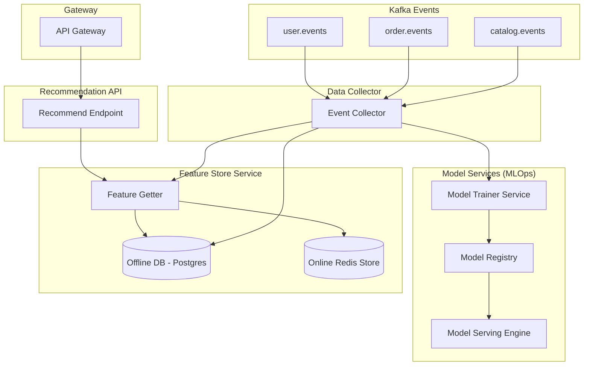
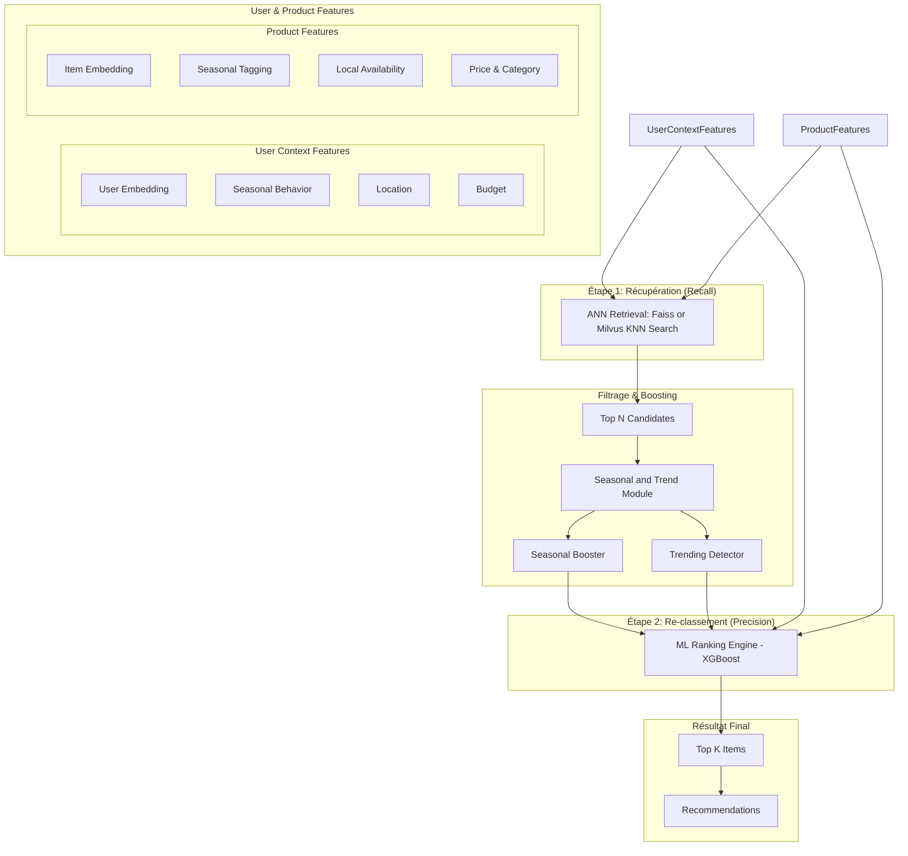
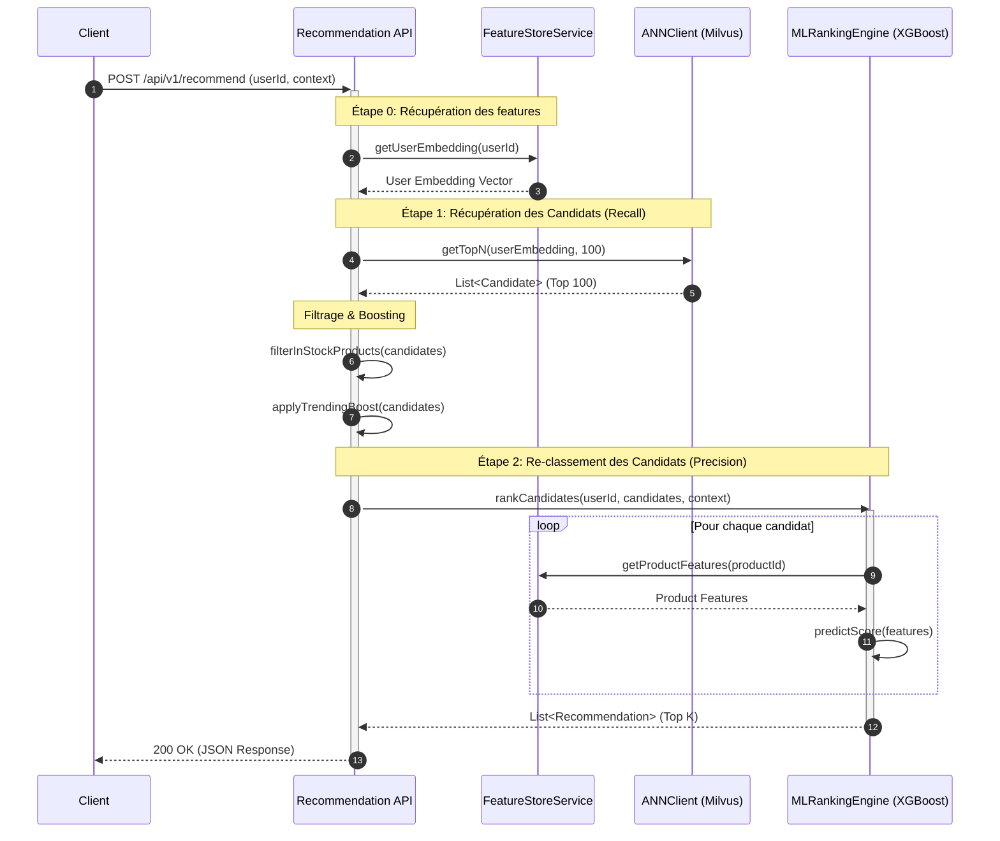
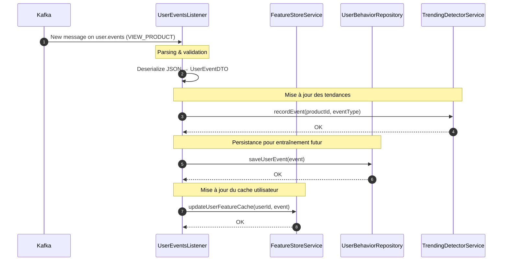
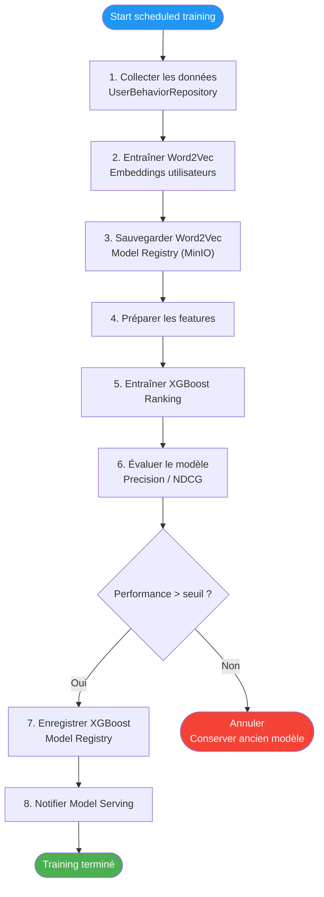
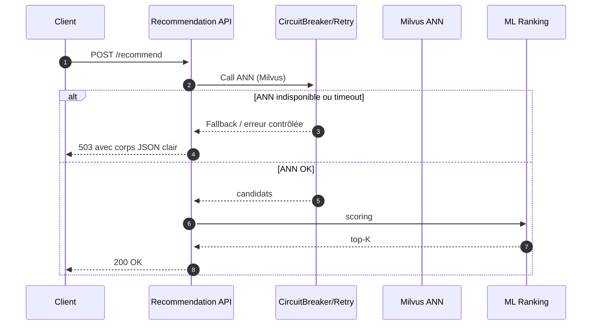

# Moteur de Recommandation E-commerce - Microservice ML

Un microservice de recommandation de niveau production, basé sur Java et Spring Boot, implémentant un système de Machine Learning de bout en bout. Il est conçu pour s'intégrer dans un écosystème e-commerce moderne et fournir des recommandations personnalisées, pertinentes et en temps réel.

## Table des Matières

- [Vue d'ensemble](#vue-densemble)
- [Architecture](#architecture)
- [Fonctionnalités Clés](#fonctionnalités-clés)
- [Stack Technologique](#stack-technologique)
- [Prérequis](#prérequis)
- [Démarrage Rapide](#démarrage-rapide)
- [Documentation de l'API](#documentation-de-lapi)
- [Implémentation des Patrons d'Architecture](#implémentation-des-patrons-darchitecture)
- [Intégration avec les Autres Services](#intégration-avec-les-autres-services)
- [Monitoring & Observabilité](#monitoring--observabilité)
- [Déploiement](#déploiement)
- [Dépannage](#dépannage)

## Vue d'ensemble

Ce service n'est pas un simple moteur de recommandation. C'est une plateforme complète qui utilise une architecture **Two-Stage Ranking** (Récupération par ANN + Re-classement par ML) pour garantir à la fois la scalabilité sur des millions d'articles et une personnalisation extrêmement fine.

Il est entièrement **event-driven**, réagissant en temps réel aux événements de la plateforme (nouveaux produits, commandes, clics utilisateur) pour maintenir ses modèles et ses features à jour.

### Responsabilités Principales

- **Fournir des recommandations personnalisées** via une API REST.
- **Ingérer les événements** de la plateforme (Kafka) pour l'entraînement et l'inférence.
- **Gérer le cycle de vie des modèles ML** (entraînement, versioning, déploiement).
- **Calculer et servir des features** en temps réel (Feature Store).
- **Détecter les tendances** produits pour booster leur popularité.

## Architecture

Notre architecture est divisée en plusieurs services logiques qui collaborent pour fournir des recommandations de haute qualité.

### Architecture des Composants



### Pipeline de Ranking Détaillé

Le cœur de notre service est le pipeline de classement en deux étapes, qui garantit pertinence et performance.



## Fonctionnalités Clés

- **Architecture Two-Stage Ranking**: Scalabilité massive en découplant la récupération rapide de candidats (ANN) du re-classement précis par un modèle ML coûteux.
- **Feature Engineering en Temps Réel**: Plus de 25 features contextuelles, comportementales et temporelles calculées à la volée pour une personnalisation maximale.
- **MLOps de Bout en Bout**: Entraînement, versioning (MinIO) et déploiement de modèles automatisés.
- **Détection de Tendances**: Un `TrendingDetectorService` basé sur Redis identifie les produits "chauds" en temps réel pour booster leur visibilité.
- **Event-Driven**: Le système est entièrement asynchrone et réagit aux événements Kafka pour des mises à jour continues.
- **Feature Store Hybride**: Combine un cache Redis (online) pour une faible latence et une base de données PostgreSQL (offline) pour la persistance.

## Stack Technologique

| Domaine | Technologie | Rôle |
|---|---|---|
| **Framework** | Spring Boot 3.3+ | Fondation de l'application |
| **Langage** | Java 17 | Langage de programmation principal |
| **Base de Données** | PostgreSQL | Stockage offline des features et embeddings |
| **Cache** | Redis | Feature Store online pour accès rapide |
| **Messagerie** | Kafka | Bus d'événements pour la communication inter-services |
| **Recherche Vectorielle**| Milvus | Base de données vectorielle pour la recherche ANN |
| **ML - Ranking** | XGBoost | Modèle de machine learning pour le re-classement |
| **ML - Embeddings** | Word2Vec (DL4J) | Génération des embeddings sémantiques |
| **Registre de Modèles**| MinIO | Stockage et versioning des modèles (compatible S3) |
| **Observabilité** | Prometheus, Micrometer | Collecte de métriques |
| **Déploiement** | Docker, Docker Compose | Conteneurisation |

## Prérequis

- **Java 17+**
- **Maven 3.9+**
- **Docker & Docker Compose**

## Démarrage Rapide

La méthode recommandée est d'utiliser le script `rebuild-and-start.ps1` qui gère tout le cycle de vie.

```powershell
# Nettoie, re-build l'image et démarre tous les services
.\rebuild-and-start.ps1
```

Après le démarrage, le service principal sera disponible sur `http://localhost:8080`.

## Documentation de l'API

### Endpoint de Recommandation

#### `POST /api/v1/recommend`

Génère des recommandations personnalisées pour un utilisateur.

**Requête:**
```json
{
  "userId": "user-123",
  "limit": 10,
  "context": {
    "season": "ramadan",
    "device": "mobile",
    "is_experiment": true
  }
}
```

**Réponse (200 OK):**
```json
{
  "recommendations": [
    {
      "productId": "prod-abc",
      "score": 0.987
    },
    {
      "productId": "prod-xyz",
      "score": 0.954
    }
  ]
}
```

### Endpoints d'Administration

#### `POST /api/v1/admin/train`
Déclenche manuellement un cycle complet d'entraînement des modèles (Word2Vec et XGBoost).

#### `GET /api/v1/admin/trending`
Retourne les produits actuellement en tendance.

## Implémentation des Patrons d'Architecture

### Two-Stage Ranking

Ce patron est essentiel pour la performance et la scalabilité.

1.  **Étape 1: Récupération (Recall)**
    - **Objectif**: Réduire un catalogue de millions de produits à quelques centaines de candidats pertinents, le plus rapidement possible.
    - **Implémentation**: Nous utilisons une recherche d'Approximate Nearest Neighbor (ANN) dans **Milvus**. À partir de l'embedding d'un utilisateur, nous récupérons les N produits les plus proches dans l'espace vectoriel. Cette opération est extrêmement rapide (millisecondes).

2.  **Étape 2: Re-classement (Precision)**
    - **Objectif**: Classer précisément la petite liste de candidats en utilisant un modèle de Machine Learning complexe et coûteux.
    - **Implémentation**: Pour chaque candidat, le `FeatureEngineer` assemble un vecteur de plus de 25 features. Le `MLRankingEngine` (utilisant un modèle **XGBoost**) prédit alors un score de pertinence. Cette étape est plus lente mais n'est appliquée qu'à une centaine de produits, ce qui la rend viable.

### Feature Store (Patron Cache-Aside)

Pour une inférence rapide, les features doivent être accessibles avec une très faible latence.

1.  **Online Store (Redis)**: Un cache Redis contient les features les plus récentes pour un accès en quelques millisecondes. Les clés ont un TTL (Time-To-Live) court pour éviter les données périmées.
2.  **Offline Store (PostgreSQL)**: Une base de données PostgreSQL stocke l'historique complet des features.
3.  **Logique Cache-Aside**:
    - L'application demande une feature au `FeatureStoreService`.
    - Le service tente de la lire dans Redis.
    - Si la feature est présente (cache hit), elle est retournée immédiatement.
    - Si elle est absente (cache miss), le service la lit dans PostgreSQL, la met à jour dans Redis avec un TTL, et la retourne.

### Principes d'Architecture et Design Patterns

- **Two-Stage Ranking (Recall + Precision)** : ANN rapide pour réduire le catalogue, puis re-classement ML coûteux sur peu de candidats.
- **Event-Driven** : Kafka pour propager les événements (user, order, catalog, inventory) et maintenir les features et modèles à jour.
- **Cache-Aside Feature Store** : Lecture d'abord en Redis (online), fallback PostgreSQL (offline), puis réécriture cache avec TTL court.
- **MLOps Séparé** : Entraînement et registre de modèles découplés de l'inférence (ModelTrainerService / ModelRegistry / ModelServingEngine).
- **Séparation des Contrats** : DTO API publics vs DTO d'intégration Kafka.
- **Idempotence et Sécurité** : Listeners Kafka conçus pour supporter les replays; filtrage out-of-stock avant scoring pour éviter les faux positifs.

### Synchrone vs Asynchrone

- **Synchrone (API /recommend)** : Récupère embeddings + ANN + filtrage + re-classement ML en une requête HTTP, latence optimisée.
- **Asynchrone (Kafka)** : Ingestion d'événements user/order/catalog/inventory, mise à jour des features, index ANN, tendances, et données d'entraînement sans bloquer l'API.
- **Batch/Planifié** : Entraînement automatique (scheduler) des modèles Word2Vec et XGBoost durant des fenêtres hors-pointe.

### Flux Détaillé d'une Requête API

Ce diagramme de séquence montre le déroulement exact d'un appel à l'API de recommandation.



## Intégration avec les Autres Services

Ce microservice est au cœur de la plateforme et ne pourrait fonctionner sans les autres. Il ne possède aucune donnée "maîtresse" mais les agrège à partir des événements.

| Service Externe | Événements Consommés (Kafka) | Rôle pour la Recommandation |
|---|---|---|
| **User Service** | `user.events` | Met à jour le comportement utilisateur, les préférences et déclenche le re-calcul des embeddings utilisateur. |
| **Order Service** | `order.events` | Analyse les produits achetés pour l'entraînement des modèles (Word2Vec) et met à jour les features de budget utilisateur. |
| **Catalog Service**| `catalog.events` | Met à jour les informations produits (prix, catégorie) et déclenche l'indexation de nouveaux produits dans Milvus. |
| **Inventory Service**| `inventory.events`| Met à jour la disponibilité des produits en temps réel pour filtrer les articles en rupture de stock AVANT le classement. |

### Flux de Traitement d'Événement en Temps Réel

Voici comment un événement `user.events` est traité pour enrichir le système.



## MLOps & Cycle de Vie des Modèles

Une section dédiée au cycle de vie des modèles ML, de l'entraînement au déploiement.

### Flux d'Entraînement Automatisé des Modèles

Ce processus est déclenché par un `Scheduler` (par exemple, tous les jours à 3h du matin).



## Monitoring & Observabilité

- **Health Checks**: `GET /actuator/health` fournit l'état de santé du service.
- **Metrics Prometheus**: `GET /actuator/prometheus` expose des métriques détaillées sur la latence des recommandations, le taux de hit du cache, etc.
- **Logs Structurés**: Tous les logs sont au format JSON avec un `traceId` pour un suivi distribué facile.

## Résilience & Observabilité (détaillé)

- **Circuit Breaker / Retry / Timeout** : à appliquer sur les appels externes (Milvus, Redis, Postgres) pour éviter les blocages ; listeners Kafka sont idempotents pour tolérer les replays.
- **Bulkhead** : limiter la concurrence par ressource (pools de connexions) pour protéger le service en pic de charge.
- **Métriques clés** : `recommendation.request.time`, `http_server_requests_seconds` (P50/95/99), `cache_hits` (Feature Store), lag/erreurs Kafka, mémoire/GC JVM.
- **Santé** : `GET /api/v1/health` (ping), `GET /actuator/health` (détails), `GET /actuator/prometheus` (scrape Prometheus).

### Diagramme de résilience (chemin d'échec rapide)



## Configuration (extrait `application.yml`)

```yaml
server:
    port: 8080

spring:
    kafka:
        bootstrap-servers: kafka:9092
    redis:
        host: redis
        port: 6379
    datasource:
        url: jdbc:postgresql://postgres:5432/recommendations
        username: rec_user
        password: rec_password

milvus:
    host: milvus
    port: 19530

feature-store:
    redis-ttl-seconds: 300

minio:
    endpoint: http://minio:9000
    access-key: minioadmin
    secret-key: minioadmin
```

## API Santé & Admin (rappel)

- `GET /api/v1/health` : ping rapide.
- `GET /actuator/health` : santé détaillée.
- `GET /actuator/prometheus` : métriques Prometheus.
- `POST /api/v1/admin/train` : lancer un cycle d'entraînement ML.
- `GET /api/v1/admin/trending` : produits en tendance.

## Tests

- **Unitaires** : `mvn test`
- **Ciblés** : `mvn test -Dtest=FeatureEngineerTest` (exemple).
- **Intégration** : `mvn test -Dtest=RecommendationFlowIT`
- **Scénarios clés** : cache hit/miss Feature Store, filtrage out-of-stock, fallback si Milvus ou Redis indisponible.
- **Mocks** : WireMock ou Testcontainers pour simuler Milvus/Redis/Postgres si nécessaire.

## Déploiement

- **Docker Compose (dev)** : `docker compose up -d` puis `docker compose logs -f recommendation`.
- **Rebuild complet** : `.\rebuild-and-start.ps1`
- **Kubernetes (optionnel)** : appliquer les manifests `k8s/` (Postgres, Redis, Kafka, Milvus, recommendation), puis `kubectl port-forward` pour tester.
- **Variables d'env utiles** :
    - `KAFKA_BOOTSTRAP_SERVERS=kafka:9092`
    - `REDIS_HOST=redis`, `REDIS_PORT=6379`
    - `POSTGRES_HOST=postgres`, `POSTGRES_PORT=5432`, `POSTGRES_DB=recommendations`, `POSTGRES_USER=rec_user`, `POSTGRES_PASSWORD=rec_password`
    - `MILVUS_HOST=milvus`, `MILVUS_PORT=19530`
    - `FEATURE_STORE_REDIS_TTL_SECONDS=300`
    - `MINIO_ENDPOINT=http://minio:9000`, `MINIO_ACCESS_KEY=minioadmin`, `MINIO_SECRET_KEY=minioadmin`

## Déploiement

Le déploiement est entièrement conteneurisé avec Docker.

```bash
# Démarrer tous les services (dev)
docker compose up -d

# Arrêter et nettoyer
docker compose down -v
```

Pour un environnement de production, des manifestes Kubernetes sont fournis dans le dossier `/k8s`.

## Dépannage

- **Le service ne démarre pas**: Vérifiez les logs (`docker compose logs recommendation`). Les causes communes sont un conflit de port ou un service dépendant (Kafka, Milvus) qui n'est pas encore prêt.
- **Recommandations lentes**: Surveillez la métrique `recommendation.request.time` dans Prometheus. Une latence élevée peut indiquer un taux de "cache miss" important dans le Feature Store.
- **Pas de recommandations retournées**: Assurez-vous que les listeners Kafka fonctionnent et que les données sont bien ingérées dans la base offline et dans Milvus.
